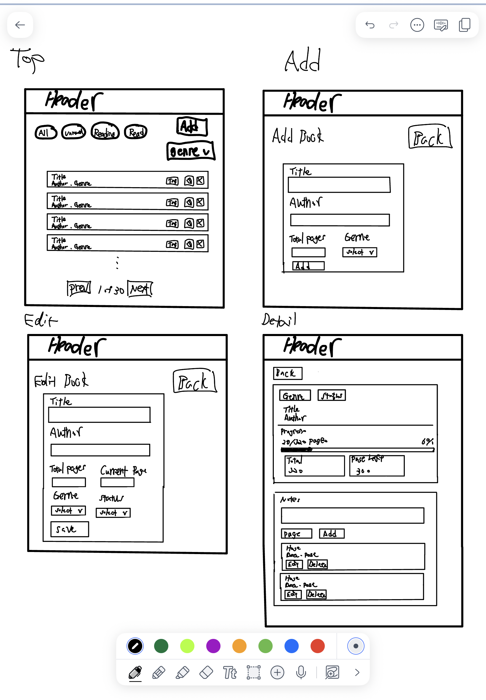

# Desing Doc

*Project 2 Name*: BookKeep — A Minimalist Personal Library and Reading Tracker

*Team Members*: Shota Togawa , Daiwei Zhang

## Description:

BookKeep is a lightweight personal library web app for readers who want to manage their books without the distraction of a large social reading platform. Users can add books to a digital shelf, organize them by reading status, update reading progress, rate finished books, and attach short personal notes to specific books.
For this project scope, it will focus on persistent CRUD functionality for two MongoDB collections: Books and Notes. The Books collection stores the user’s reading library, while the Notes collection stores reflections or study notes linked to individual books.

## User Personas:

1. Elena, The Avid Reader:
 Elena is 29 years old and reads 3–4 books a month. She enjoys tracking reading progress and organizing books by genre or status. She needs a simple digital shelf to log what she wants to read, what she is currently reading, and what she has completed.
2. Marcus, The Intentional Learner:
 Marcus is 34 years old and a graduate student who reads dense technical books. He needs a distraction-free tool to store a backlog of textbooks, track progress, and add quick personal study notes to each book.

## User Stories:

### Books Collection:

- As a user, I want to add a new book with a title, author, total pages, current page, genre, and status, so I can grow my digital library.
- As a user, I want to view a list of all my books and filter them by reading status, so I can easily see what I plan to read, what I am currently reading, and what I have completed.
- As a user, I want to view a detailed page for one book, so I can see its metadata, reading progress, rating, and related notes.
- As a user, I want to update a book’s details, reading status, current page, and rating, so my library stays accurate as I continue reading.
- As a user, I want to delete a book from my library, so I can remove books I added by mistake or no longer want to track.

### Notes Collection:
- As a user, I want to add a note to a specific book, so I can save thoughts, quotes, or study comments while reading.
- As a user, I want to view all notes connected to a book, so I can review my thoughts in one place.
- As a user, I want to edit a note, so I can revise my thoughts or correct mistakes.
- As a user, I want to delete a note, so I can remove notes that are no longer useful.

## Work Division:
**Shota Togawa** — Books Management Feature, 

- Full Stack: 
    - Frontend: Books list page, book detail page, add/edit book form, reading status filter, and book delete controls.
    - Backend & Database: Express API routes for the Books collection, including create, read, update, delete, and status filtering.

**Daiwei Zhang** — Notes Management Feature, 
- Full Stack:
    - Frontend: Notes section on the book detail page, add/edit note form, and note delete controls.
    - Backend & Database: Express API routes for the Notes collection, including create, read, update, and delete operations linked to a book by bookId.

### Shared Responsibilities: 

Homepage/navigation, MongoDB Atlas setup, project structure, ESLint/Prettier configuration, README, deployment, and demo video.

### Tech Stack:
- Frontend: Vanilla JavaScript using ES6 modules, HTML5, CSS
- Backend: Node.js + Express
- Database: MongoDB using the native MongoDB Node.js driver
- Data Requests: Fetch API

## Desing Mock

