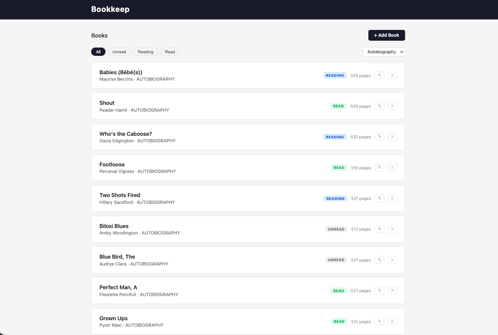
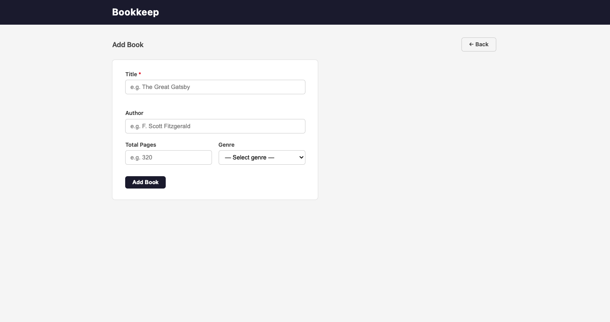
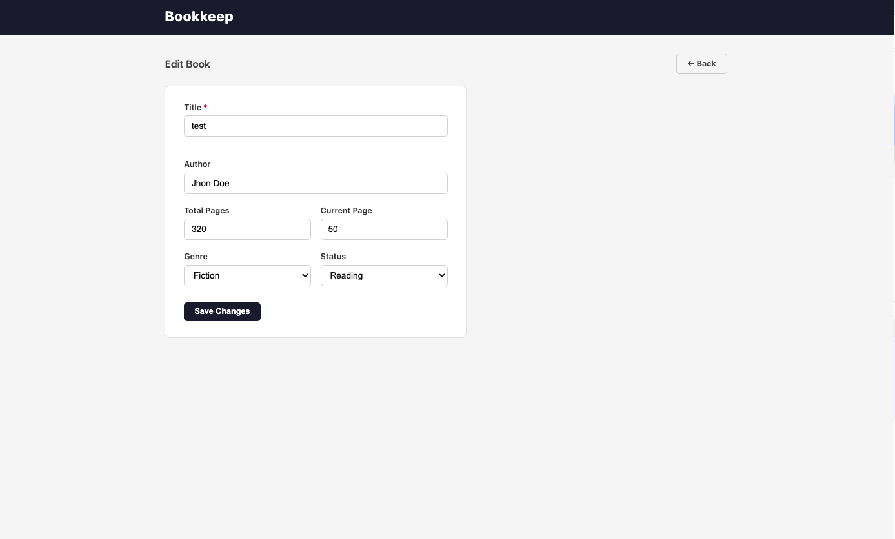

# Bookkeep

## Project Objective

A personal reading tracker that lets you manage your book collection — add books, track reading progress, and filter by status or genre.

- **Author:** Shota Togawa, Daiwei Zhang
- **Class Link:** https://johnguerra.co/classes/webDevelopment_online_summer_2026/
- **Live demo:** https://tg112.github.io/bookkeep
- [**Desing Doc**](./DESIGNDOC.md)





## Features

- Browse your book list with status and genre filters
- Paginated results (20 books per page, server-side)
- Add, edit, and delete books
- Track reading progress (current page / total pages)
- Book fields: title, author, total pages, current page, genre, status

**Genres:** Fiction, Non-Fiction, Biography, Autobiography, History, Business, Technology, Science, Economics

**Statuses:** Unread, Reading, Read

## Tech Stack

| Layer | Technology |
|---|---|
| Frontend | Vanilla JavaScript (ES Modules), HTML, CSS |
| Backend | Node.js, Express 5 |
| Database | MongoDB (native driver) |
| Hosting | GitHub Pages (frontend) · Render (backend) |

## Project Structure

```
.
├── backend/
│   ├── index.js          # Express app entry point
│   ├── db.js             # MongoDB connection
│   ├── routers/
│   │   └── books.js      # Route definitions
│   ├── controllers/
│   │   └── books.js      # Request handlers
│   └── models/
│       └── Book.js       # Collection accessor
├── docs/                 # Production frontend (served via GitHub Pages)
│   ├── index.html
│   ├── book.html
│   ├── register.html
│   ├── edit.html
│   ├── constants/
│   │   └── index.js      # API base URL 
│   ├── js/
│   └── styles/
└── package.json
```

## Getting Started

### Prerequisites

- Node.js 18+
- MongoDB running locally on `mongodb://localhost:27017`

### Installation

```bash
git clone https://github.com/tg112/bookkeep.git
cd bookkeep
npm install
```

### Running locally

```bash
npm start
```

The server starts on `http://localhost:3000`.
Open `docs/index.html` directly in your browser, or serve it with any static file server — the frontend auto-detects `localhost` and points to `http://localhost:3000/api`.

### Environment variables

| Variable | Default | Description |
|---|---|---|
| `MONGODB_URI` | `mongodb://localhost:27017` | MongoDB connection string |
| `DB_NAME` | `bookkeep` | Database name |

## API Reference

Base URL (production): `https://bookkeep-8vm7.onrender.com/api`

| Method | Endpoint | Description |
|---|---|---|
| `GET` | `/books` | List books (supports filtering & pagination) |
| `GET` | `/books/:id` | Get a single book |
| `POST` | `/books` | Create a book |
| `PATCH` | `/books/:id` | Update a book |
| `DELETE` | `/books/:id` | Delete a book |

### `GET /books` query parameters

| Parameter | Type | Description |
|---|---|---|
| `status` | `UNREAD` \| `READING` \| `READ` | Filter by reading status |
| `genre` | e.g. `FICTION` | Filter by genre |
| `page` | number (default `1`) | Page number |
| `limit` | number (default `20`, max `100`) | Items per page |

**Response**
```json
{
  "books": [...],
  "total": 42,
  "page": 1,
  "totalPages": 3
}
```

### `POST /books` request body

```json
{
  "title": "The Great Gatsby",
  "author": "F. Scott Fitzgerald",
  "totalPages": 180,
  "genre": "FICTION"
}
```

`currentPage` defaults to `0` and `status` defaults to `UNREAD` if omitted.

## License

MIT
